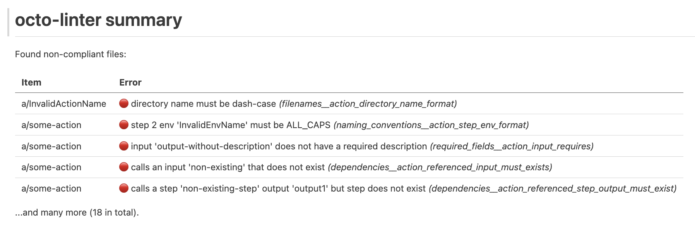

# Demo

## Clone and run
An example configuration file and `.github` directory structure can be found in the `example` directory of the 
repository. Use below commands to see octo-linter in action:

````
git clone https://github.com/keenbytes/octo-linter.git
cd octo-linter/example

docker run --platform=linux/amd64 --rm --name octo-linter \
  -v $(pwd)/dot-github:/dot-github \
  -v $(pwd):/config \
  keenbytes/octo-linter:v2.1.2 \
  lint -p /dot-github -l WARN -c /config/config.yml
````

## Output
This should generate an output similar to the following:

````
time=(...) level=ERROR msg="(...)/actions/InvalidActionName/action.yml filenames__action_directory_name_format: directory name must be dash-case"
time=(...) level=ERROR msg="(...)/actions/some-action/action.yml dependencies__action_referenced_step_output_must_exist: calls a step 'non-existing-step' output 'output1' but step does not exist"
time=(...) level=ERROR msg="(...)/actions/InvalidActionName/action.yml used_actions_in_action_steps__source: step 1 calls action 'actions/checkout@v4' that is not a valid local path"
time=(...) level=ERROR msg="(...)/actions/InvalidActionName/action.yml used_actions_in_action_steps__source: step 1 calls action 'actions/checkout@v4' that is not a valid local path"
time=(...) level=ERROR msg="(...)/actions/some-action/action.yml naming_conventions__action_step_env_format: step 2 env 'InvalidEnvName' must be ALL_CAPS"
time=(...) level=ERROR msg="(...)/actions/some-action/action.yml dependencies__action_referenced_input_must_exists: calls an input 'non-existing' that does not exist"
time=(...) level=ERROR msg="(...)/actions/some-action/action.yml dependencies__action_referenced_input_must_exists: calls an input 'non-existing' that does not exist"
time=(...) level=ERROR msg="(...)/actions/some-action/action.yml used_actions_in_action_steps__source: step 1 calls action 'actions/checkout@v4' that is not a valid local path"
time=(...) level=ERROR msg="(...)/actions/some-action/action.yml referenced_variables_in_actions__not_in_double_quotes: calls a variable 'inputs.non-existing' that is in double quotes"
time=(...) level=ERROR msg="(...)/actions/some-action/action.yml used_actions_in_action_steps__source: step 1 calls action 'actions/checkout@v4' that is not a valid local path"
time=(...) level=ERROR msg="(...)/actions/InvalidActionExtension/action.yaml filenames__action_directory_name_format: directory name must be dash-case"
time=(...) level=ERROR msg="(...)/actions/InvalidActionExtension/action.yaml filenames__action_filename_extensions_allowed: file extension must be one of: yml"
time=(...) level=ERROR msg="(...)/actions/InvalidActionExtension/action.yaml filenames__action_filename_extensions_allowed: file extension must be one of: yml"
time=(...) level=ERROR msg="(...)/actions/InvalidActionExtension/action.yaml used_actions_in_action_steps__source: step 1 calls action 'actions/checkout@v4' that is not a valid local path"
time=(...) level=ERROR msg="(...)/actions/InvalidActionExtension/action.yaml used_actions_in_action_steps__source: step 1 calls action 'actions/checkout@v4' that is not a valid local path"
time=(...) level=ERROR msg="(...)/workflows/workflow1.yaml dependencies__workflow_referenced_input_must_exists: calls an input 'non-existing' that does not exist"
time=(...) level=ERROR msg="(...)/workflows/workflow1.yaml dependencies__workflow_referenced_input_must_exists: calls an input 'non-existing' that does not exist"
time=(...) level=ERROR msg="(...)/workflows/workflow1.yaml workflow_runners__not_latest: job 'job-2' should not use 'latest' in 'runs-on' field"
time=(...) level=ERROR msg="(...)/workflows/workflow1.yaml filenames__workflow_filename_extensions_allowed: file extension must be one of: yml"
time=(...) level=ERROR msg="(...)/workflows/workflow1.yaml filenames__workflow_filename_extensions_allowed: file extension must be one of: yml"
time=(...) level=ERROR msg="(...)/workflows/workflow1.yaml referenced_variables_in_workflows__not_in_double_quotes: calls a variable 'inputs.non-existing' that is in double quotes"
time=(...) level=ERROR msg="(...)/workflows/workflow1.yaml used_actions_in_workflow_job_steps__source: job 'job-2' step 3 calls action 'external-action/something@v2' that is not a valid local path"
time=(...) level=ERROR msg="(...)/workflows/workflow1.yaml used_actions_in_workflow_job_steps__source: job 'job-1' step 1 calls action 'external-action/something@v2' that is not a valid local path"
time=(...) level=ERROR msg="(...)/workflows/workflow1.yaml used_actions_in_workflow_job_steps__source: job 'job-1' step 7 calls action 'external-action/something@v2' that is not a valid local path"
time=(...) level=ERROR msg="(...)/workflows/workflow1.yaml used_actions_in_workflow_job_steps__source: job 'job-2' step 1 calls action 'external-action/something@v2' that is not a valid local path"
````

## Markdown summary
octo-linter can generate a simple summary in Markdown format that can be posted as a comment to a pull request.  Create a directory,
for example `output`, and add `--output output` (`-o`) flag to the command to generate an `output.md` file inside of it.

Markdown can be limited to print out only certain amount of errors.  This can be set with `--output-errors` (`-u`) flag.

Please see modified code below:

````
mkdir output

docker run --platform=linux/amd64 --rm --name octo-linter \
  -v $(pwd)/dot-github:/dot-github \
  -v $(pwd):/config \
  -v $(pwd)/output:/output \
  keenbytes/octo-linter:v2.1.2 \
  lint -p /dot-github -l WARN -c /config/config.yml -o /output -u 5
````

### Screenshot of generated Markdown file



## Exit code
Tool exits with exit code `0` when everything is fine.  `1` when there are errors, `2` when there are only
warnings.  Additionally it may exit with a different code, eg. `22`.  These numbers indicate another error
whilst reading files.

## Checking secrets and vars
octo-linter can scan the code for `secrets` and `variables` and compare them with file containing list of defined one.  If there is any `secret`
or `var` that is not on the list, tool will output info about it.  See below run and its output.

````
docker run --platform=linux/amd64 --rm --name octo-linter \
  -v $(pwd)/dot-github:/dot-github \
  -v $(pwd):/config \
  keenbytes/octo-linter:v2.1.2 \
  lint -p /dot-github -l WARN -c /config/config.yml \
  -s /config/secrets_list.txt \
  -z /config/vars_list.txt \
  2>&1 | grep NON_EXISTING_ONE
time=2025-06-08T22:09:18.788Z level=ERROR msg="workflow_called_variable_exists_in_file: workflow 'workflow1.yaml' calls a variable 'NON_EXISTING_ONE' that does not exist in the vars file"
time=2025-06-08T22:09:18.789Z level=ERROR msg="workflow_called_variable_exists_in_file: workflow 'workflow1.yaml' calls a secret 'NON_EXISTING_ONE' that does not exist in the secrets file"
````
